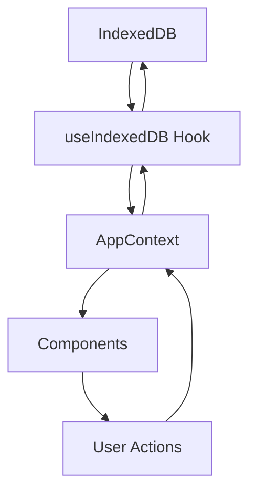

# 📝 SGCPD - Sistema de Gestão de Conteúdo Pessoal Dinâmico

<div align="center">


_Sistema moderno e responsivo para gerenciamento inteligente de notas pessoais_

[🚀 Demo](#-demonstração) • [⚡ Instalação](#-instalação-rápida) • [📖 Documentação](#-documentação) • [🤝 Contribuição](#-contribuição)

</div>

---

## 🎯 **Visão Geral**

O **SGCPD** é um sistema web moderno e intuitivo para gerenciamento de notas pessoais, desenvolvido com foco na **experiência do usuário**, **responsividade** e **performance**. O projeto combina tecnologias de ponta para oferecer uma solução completa de organização de conteúdo pessoal.

### **🌟 Características Principais**

- **🎨 Interface Moderna**: Design limpo e intuitivo baseado em shadcn/ui
- **📱 100% Responsivo**: Experiência otimizada para desktop, tablet e mobile
- **⚡ Performance**: Desenvolvido com Vite e React 18 para máxima velocidade
- **🎯 Acessibilidade**: Implementação completa de padrões WCAG
- **💾 Armazenamento Local**: Dados persistidos localmente com IndexedDB
- **🔧 TypeScript**: Tipagem forte para maior confiabilidade do código

---

## 🎓 **Contexto Acadêmico**

Este projeto foi desenvolvido como trabalho prático da disciplina de **Frontend** ministrada pelo **Prof. MSc. Reinaldo de Souza Júnior** no programa de **Residência em TI**.

### **📚 Objetivos Educacionais**

- Aplicação prática de tecnologias modernas de frontend
- Desenvolvimento de interfaces responsivas e acessíveis
- Implementação de boas práticas em React e TypeScript
- Experiência com ferramentas de build e desenvolvimento modernas
- Aplicação de princípios de UX/UI design

---

## 🚀 **Funcionalidades Detalhadas**

### **📝 Gestão de Notas**

#### **Criação e Edição**

- ✅ **Editor Intuitivo**: Interface WYSIWYG para criação de notas
- ✅ **Auto-save**: Salvamento automático das alterações
- ✅ **Títulos Dinâmicos**: Títulos podem ser editados inline
- ✅ **Conteúdo Rico**: Suporte a texto formatado e quebras de linha

#### **Organização Inteligente**

- ✅ **Categorização**: Sistema de categorias com cores personalizadas
- ✅ **Tags Flexíveis**: Sistema de tags para organização granular
- ✅ **Favoritos**: Marcar notas importantes como favoritas
- ✅ **Busca Avançada**: Busca em tempo real por título e conteúdo

#### **Visualização e Navegação**

- ✅ **Lista Responsiva**: Visualização otimizada para diferentes telas
- ✅ **Painéis Redimensionáveis**: Interface adaptável no desktop
- ✅ **Timestamps**: Data de criação e última modificação
- ✅ **Contadores**: Visualização rápida de quantidade de tags

### **👤 Gestão de Usuários**

#### **Sistema de Autenticação Local**

- ✅ **Cadastro Simples**: Registro com nome e email
- ✅ **Login Rápido**: Acesso através do email cadastrado
- ✅ **Perfil de Usuário**: Visualização do avatar e informações
- ✅ **Logout Seguro**: Encerramento seguro da sessão

### **📱 Experiência Mobile**

#### **Design Mobile-First**

- ✅ **Layout Adaptativo**: Interface otimizada para toque
- ✅ **Navegação Mobile**: Menu lateral deslizante
- ✅ **Gestos Intuitivos**: Interações naturais em dispositivos móveis
- ✅ **Performance Touch**: Responsividade otimizada para toque

### **🎨 Interface e Usabilidade**

#### **Design System Consistente**

- ✅ **Tema Moderno**: Paleta de cores profissional
- ✅ **Componentes Reutilizáveis**: Baseado em shadcn/ui
- ✅ **Animações Suaves**: Transições e micro-interações
- ✅ **Feedback Visual**: Estados claros de hover, focus e loading

#### **Acessibilidade (A11y)**

- ✅ **ARIA Labels**: Rótulos descritivos para leitores de tela
- ✅ **Navegação por Teclado**: Suporte completo a navegação por tab
- ✅ **Contraste Alto**: Cumprimento dos padrões WCAG
- ✅ **Semântica HTML**: Estrutura HTML acessível

---

## 🛠️ **Stack Tecnológica**

### **🎯 Frontend Core**

| Tecnologia       | Versão | Propósito               |
| ---------------- | ------ | ----------------------- |
| **React**        | 18.3.1 | Framework principal     |
| **TypeScript**   | 5.8.3  | Tipagem estática        |
| **Vite**         | 5.4.19 | Build tool e dev server |
| **React Router** | 6.30.1 | Roteamento SPA          |

### **🎨 Design & UI**

| Tecnologia       | Versão  | Propósito                 |
| ---------------- | ------- | ------------------------- |
| **Tailwind CSS** | 3.4.17  | Framework CSS utilitário  |
| **shadcn/ui**    | -       | Biblioteca de componentes |
| **Radix UI**     | Várias  | Componentes acessíveis    |
| **Lucide React** | 0.462.0 | Ícones modernos           |

### **💾 Dados & Estado**

| Tecnologia        | Versão | Propósito               |
| ----------------- | ------ | ----------------------- |
| **IndexedDB**     | Nativo | Armazenamento local     |
| **React Context** | Nativo | Gerenciamento de estado |
| **React Hooks**   | Nativo | Lógica de componentes   |

### **🔧 Ferramentas de Desenvolvimento**

| Tecnologia       | Versão  | Propósito                |
| ---------------- | ------- | ------------------------ |
| **ESLint**       | 9.32.0  | Linting de código        |
| **PostCSS**      | 8.5.6   | Processamento CSS        |
| **Autoprefixer** | 10.4.21 | Prefixos CSS automáticos |

---

## 🏗️ **Arquitetura do Projeto**

Este projeto agora possui uma arquitetura **full-stack** com frontend e backend separados:

```
dynamic-personal-content-management-system/
├── frontend/          # React + TypeScript + Vite
│   ├── src/
│   ├── public/
│   ├── package.json
│   └── ...
├── backend/           # Node.js + Express + PostgreSQL + Prisma
│   ├── src/
│   ├── prisma/
│   ├── package.json
│   └── ...
└── README.md
```

## ⚡ **Instalação Rápida**

### **Pré-requisitos**

Certifique-se de ter instalado:

- **Node.js** 18+ ([Download](https://nodejs.org/))
- **npm** ou **yarn** ou **pnpm**
- **Git** ([Download](https://git-scm.com/))
- **PostgreSQL** 13+ ([Download](https://www.postgresql.org/download/))

### **Frontend (React)**

1. **Navegue para o diretório frontend:**
   ```bash
   cd frontend
   ```

2. **Instale as dependências:**
   ```bash
   npm install
   ```

3. **Execute o frontend:**
   ```bash
   npm run dev
   ```

4. **Acesse no navegador:**
   ```
   http://localhost:5173
   ```

### **Backend (API)**

1. **Navegue para o diretório backend:**
   ```bash
   cd backend
   ```

2. **Instale as dependências:**
   ```bash
   npm install
   ```

3. **Configure o banco de dados:**
   ```bash
   cp .env.example .env
   # Edite o .env com suas configurações do PostgreSQL
   ```

4. **Execute as migrações:**
   ```bash
   npm run migrate
   npm run db:seed
   ```

5. **Execute o backend:**
   ```bash
   npm run dev
   ```

6. **Acesse a API:**
   ```
   http://localhost:3001
   ```

7. **Documentação da API:**
   ```
   http://localhost:3001/api-docs
   ```

### **🔧 Scripts Disponíveis**

```bash
# Desenvolvimento
npm run dev          # Inicia servidor de desenvolvimento

# Build
npm run build        # Build de produção
npm run build:dev    # Build de desenvolvimento

# Qualidade
npm run lint         # Executa ESLint
npm run preview      # Preview do build de produção
```

---

## 📖 **Documentação**

### **🏗️ Arquitetura do Projeto**

```
src/
├── 📁 components/          # Componentes React
│   ├── 📁 layout/         # Componentes de layout
│   │   ├── AppLayout.tsx   # Layout principal
│   │   ├── AppSidebar.tsx  # Sidebar desktop
│   │   ├── MobileLayout.tsx # Layout mobile
│   │   └── MobileNavigation.tsx # Navegação mobile
│   ├── 📁 notes/          # Componentes de notas
│   │   ├── NotesList.tsx   # Lista de notas
│   │   └── NoteEditor.tsx  # Editor de notas
│   └── 📁 ui/             # Componentes UI base
│       ├── button.tsx      # Componente de botão
│       ├── input.tsx       # Componente de input
│       ├── card.tsx        # Componente de card
│       └── ... (outros)
├── 📁 contexts/           # Contextos React
│   └── AppContext.tsx     # Contexto principal da aplicação
├── 📁 hooks/              # Custom hooks
│   ├── useIndexedDB.ts    # Hook para IndexedDB
│   ├── use-mobile.tsx     # Hook para detecção mobile
│   └── useNotesEditorSplit.ts # Hook para painéis
├── 📁 lib/                # Utilitários
│   └── utils.ts           # Funções auxiliares
├── 📁 pages/              # Páginas da aplicação
│   ├── Index.tsx          # Página principal
│   └── NotFound.tsx       # Página 404
└── 📁 types/              # Definições TypeScript
    └── index.ts           # Tipos principais
```

### **🔄 Fluxo de Dados**



### **🎨 Design System**

#### **Cores Principais**

- **Primary**: #3B82F6 (Azul moderno)
- **Secondary**: #64748B (Cinza elegante)
- **Success**: #10B981 (Verde sucesso)
- **Warning**: #F59E0B (Amarelo alerta)
- **Error**: #EF4444 (Vermelho erro)

#### **Tipografia**

- **Font Family**: Inter, system-ui, sans-serif
- **Scale**: 12px → 14px → 16px → 18px → 24px → 32px

#### **Espaçamento**

- **Base**: 4px
- **Scale**: 4px, 8px, 12px, 16px, 20px, 24px, 32px, 40px

### **📱 Responsividade**

#### **Breakpoints**

```typescript
const BREAKPOINTS = {
  mobile: 480, // 0-479px
  tablet: 768, // 480-767px
  desktop: 1024, // 768px+
}
```

#### **Estratégia Mobile-First**

- Design iniciado para mobile
- Progressive enhancement para tablets e desktop
- Componentes específicos para cada breakpoint

---

## 🧪 **Testes e Qualidade**

### **📊 Cobertura de Qualidade**

- ✅ **ESLint**: Análise estática de código
- ✅ **TypeScript**: Verificação de tipos
- ✅ **Prettier**: Formatação consistente
- ✅ **Performance**: Otimização com Vite

### **🔍 Checklist de Qualidade**

- [x] Código 100% TypeScript
- [x] Componentes reutilizáveis
- [x] Hooks customizados bem estruturados
- [x] Gerenciamento de estado centralizado
- [x] Tratamento de erros adequado
- [x] Performance otimizada
- [x] Acessibilidade implementada

---

## 🚀 **Demonstração**

### **💻 Desktop Experience**

- Interface com painéis redimensionáveis
- Sidebar colapsável
- Visualização simultânea de lista e editor

### **📱 Mobile Experience**

- Navegação por drawer lateral
- Interface touch-friendly
- Layouts adaptativos

### **⚡ Performance**

- Carregamento inicial < 2s
- Interações fluidas 60fps
- Bundle otimizado < 500KB

---

## 🤝 **Contribuição**

### **💡 Como Contribuir**

1. **Fork** o projeto
2. **Crie** uma branch para sua feature (`git checkout -b feature/AmazingFeature`)
3. **Commit** suas mudanças (`git commit -m 'Add some AmazingFeature'`)
4. **Push** para a branch (`git push origin feature/AmazingFeature`)
5. **Abra** um Pull Request

### **📋 Guidelines**

#### **Código**

- Use TypeScript para 100% do código
- Siga as convenções do ESLint
- Escreva componentes reutilizáveis
- Documente funções complexas

#### **Commits**

```
feat: adiciona nova funcionalidade
fix: corrige bug específico
docs: atualiza documentação
style: melhorias de estilo
refactor: refatoração de código
test: adiciona testes
chore: tarefas de manutenção
```

### **🐛 Reportar Bugs**

Use o template de issue para reportar bugs:

- Descrição clara do problema
- Passos para reproduzir
- Comportamento esperado
- Screenshots (se aplicável)
- Informações do ambiente

---

## 📜 **Licença**

Este projeto está licenciado sob a **MIT License** - veja o arquivo [LICENSE](LICENSE) para detalhes.

---

## 👨‍💻 **Autor**

**Desenvolvido por:**

- 👤 Iury Tavares
- 👤 João Paulo Pacheco
- 👤 Lucas Fernandes Silva
- 👤 Marcos Vinícius de Souza Oliveira

---

## 🙏 **Agradecimentos**

### **🎓 Acadêmicos**

- **Prof. MSc. Reinaldo de Souza Júnior** - Orientação e mentoria na disciplina de Frontend
- **Programa de Residência em TI** - Oportunidade de aprendizado e desenvolvimento

### **🛠️ Tecnológicos**

- **React Team** - Framework incrível
- **Vercel** - Pela ferramenta Vite
- **shadcn** - Biblioteca de componentes elegante
- **Radix UI** - Componentes acessíveis
- **Tailwind CSS** - Framework CSS utilitário

---

<div align="center">

### ⭐ **Se este projeto te ajudou, considere dar uma estrela!**

[⬆ Voltar ao topo](#-sgcpd---sistema-de-gestão-de-conteúdo-pessoal-dinâmico)

</div>
